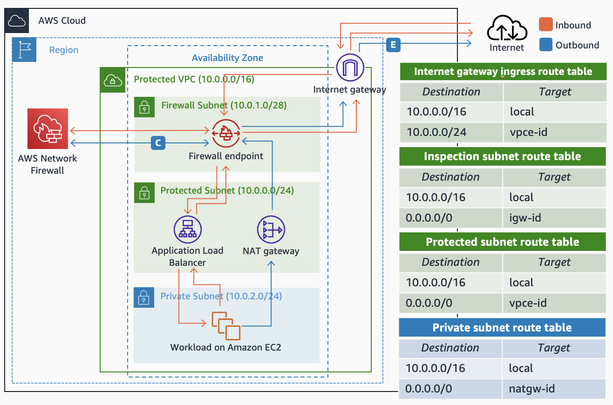
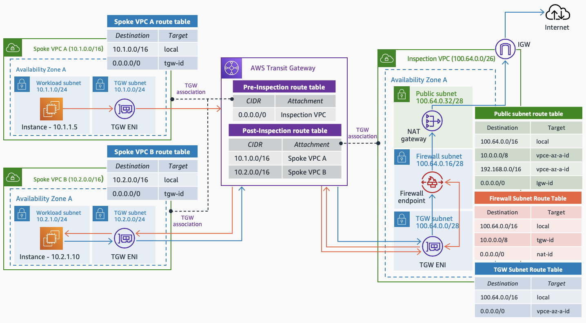

# AWS Network Firewall Module

AWS Network Firewall is a stateful, managed, network firewall and intrusion detection and prevention service for Amazon Virtual Private Clouds (Amazon VPCs). This module can be used to deploy an AWS Network Firewall resource in the desired VPC, automating all the routing and logging configuration when the resource is deployed.

This module only handles the creation of the infrastructure, leaving full freedom to the user to define the firewall rules (which should be done outside the module). Same applies to IAM roles and KMS keys when you define the logging of the firewall - rememeber that it is a best practice to encryt at rest your firewall logs.

## Usage

To create AWS Network Firewall in your VPC, you need to provide the following information:

- `network_firewall_name`= (Required|string) Name to provide the AWS Network Firewall resource.
- `network_firewall_policy`= (Required|string) ARN of the firewall policy to apply in the AWS Network Firewall resource. Check the definition of [AWS Network Firewall Policies](https://registry.terraform.io/providers/hashicorp/aws/latest/docs/resources/networkfirewall_firewall_policy) and [AWS Network Firewall Rule Groups](https://registry.terraform.io/providers/hashicorp/aws/latest/docs/resources/networkfirewall_rule_group) to see how you can create firewall policies.
- `network_firewall_policy_change_protection` = (Optional|bool) To indicate whether it is possible to change the associated firewall policy after creation. Defaults to `false`.
- `network_firewall_subnet_change_protection` = (Optional|bool) To indicate whether it is possible to change the associated subnet(s) after creation. Defaults to `false`.
- `vpc_id` = (Required|string) ID of the VPC where the AWS Network Firewall resource should be placed.
- `vpc_subnets` = (Required|map(string)) Map of subnet IDs to place the Network Firewall endpoints. Example:

```hcl
vpc_subnets = {
    us-east-1a = subnet-IDa
    us-east-1b = subnet-IDb
    us-east-1c = subnet-IDc
}
```
- `routing_configuration` = (Required|any) Configuration of the routing desired in the VPC. Depending the type of VPC, the information to provide is different. The type of VPCs supported are: `single_vpc`, `single_vpc_routing_enhacement`, `centralized_inspection_without_egress`, and `centralized_inspection_with_egress`. **Only one key (option) can be defined**. More information about the differences between each of the VPC types (and examples) can be checked in the section below.
- `tags`= (Optional|map(string)) List of tags to apply to the AWS Network Firewall resource.

## Routing configuration

Once the AWS Network Firewall resource is created, the routing to the firewall endpoints need to be created. However, depending the VPC and how we want to inspect the traffic, this routing configuration is going to be different. The module supports the routing configuration of 4 different types of VPCs, covering the most common [Inspection Deployment models with with AWS Network Firewall](https://d1.awsstatic.com/architecture-diagrams/ArchitectureDiagrams/inspection-deployment-models-with-AWS-network-firewall-ra.pdf).

### Single VPC

The first use case is when the firewall endpoints are located in the VPC to inspect the traffic from/to workloads in that same VPC - distributed inspection model. If using this routing configuration (`simple_vpc`) it is expected to place the firewall endpoints in subnets between the Internet gateway (IGW) and the public subnets (where you can place the Elastic Load Balancers and NAT gateways). The image below shows an example of the architecture, routing configuration, and traffic flow.



An example of the definition of this routing configuration is the following one:

```hcl
routing_configuration = { 
    single_vpc = { 
      igw_route_table = rtb-ID
      route_tables = { 
        us-east-1a = rtb-IDa
        us-east-1b = rtb-IDb
        us-east-1c = rtb-IDc
      }
      cidr_blocks = {
        us-east-1a = "10.0.0.0/24"
        us-east-1b = "10.0.1.0/24"
        us-east-1c = "10.0.2.0/24"
      }
    }
}
```

### Single VPC (routing enhacement)

When placing firewall endpoints to inspect traffic between workloads inside the same VPC (between your EC2 instances and the database layer, for example) you can take advantage of the VPC routing enhacement - which allows you to include more specific routing than the local one (`single_vpc_routing_enhacement`). The image below shows an example of the architecture, routing configuration, and traffic flow.


An example of the definition of this routing configuration is the following one. The module expects in this variable a map of routing configurations with two keys each of them - `route_tables` and `cidr_blocks`.

```hcl
routing_configuration = { 
    single_vpc_routing_enhacement = { 
      workload_to_db = { 
        route_tables = { 
          us-east-1a = rtb-IDa
          us-east-1b = rtb-IDb
          us-east-1c = rtb-IDc
        }
        cidr_blocks = {
          us-east-1a = "10.0.0.0/24"
          us-east-1b = "10.0.1.0/24"
          us-east-1c = "10.0.2.0/24"
        }
      }
      db_to_workload = {
        route_tables = { 
          us-east-1a = rtb-IDaa
          us-east-1b = rtb-IDbb
          us-east-1c = rtb-IDcc
        }
        cidr_blocks = {
          us-east-1a = "10.0.3.0/24"
          us-east-1b = "10.0.4.0/24"
          us-east-1c = "10.0.5.0/24"
        }
      }
    }
}
```

### Hub and Spoke with Inspection VPC 

The use case covers the creation of a centralized Inspection VPC in a Hub and Spoke architecture with AWS Transit Gateway, with the idea of managing the traffic inspection at scale. When using the key `centralized_inspection_without_egress` it is supposed that the Inspection VPC created is only used to place the AWS Transit Gateway ENIs and the firewall endpoints. The image below shows an example of the architecture, routing configuration, and traffic flow.


An example of the definition of this routing configuration is the following one:

```hcl
routing_configuration = {
    centralized_inspection_without_egress = { 
      tgw_route_tables = { 
        us-east-1a = rtb-IDa
        us-east-1b = rtb-IDb
        us-east-1c = rtb-IDc
      }
    }
}
```

### Hub and Spoke with Inspection VPC (with egress traffic)

The use case covers the creation of a centralized Inspection VPC in a Hub and Spoke architecture with AWS Transit Gateway, with the idea of managing the traffic inspection at scale. When using the key `centralized_inspection_with_egress` it is supposed that the Inspection VPC also has access to the Internet, to centralize inspection and egress traffic at the same time. The image below shows an example of the architecture, routing configuration, and traffic flow.



An example of the definition of this routing configuration is the following one:

```hcl
routing_configuration = {
    centralized_inspection_with_egress = {
      tgw_route_tables = { 
        us-east-1a = rtb-IDa
        us-east-1b = rtb-IDb
        us-east-1c = rtb-IDc
      }
      public_route_tables = {
        us-east-1a = rtb-IDaa
        us-east-1b = rtb-IDbb
        us-east-1c = rtb-IDcc
      }
      network_cidr_blocks = ["10.0.0.0/8", "192.168.0.0/24"]
    }
}
```

## References

- Reference Architecture: [Inspection Deployment models with with AWS Network Firewall](https://d1.awsstatic.com/architecture-diagrams/ArchitectureDiagrams/inspection-deployment-models-with-AWS-network-firewall-ra.pdf)
- Blog post: [Deployment models for AWS Network Firewall](https://aws.amazon.com/blogs/networking-and-content-delivery/deployment-models-for-aws-network-firewall/)
- Blog post: [Deployment models for AWS Network Firewall with VPC routing enhancements](https://aws.amazon.com/blogs/networking-and-content-delivery/deployment-models-for-aws-network-firewall-with-vpc-routing-enhancements/)
