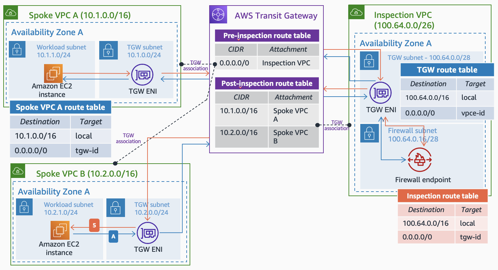

<!-- BEGIN_TF_DOCS -->
# AWS Network Firewall Module - Centralized Inspection VPC in a Hub and Spoke architecture with AWS Transit Gateway

This example shows the creation of a centralized Inspection VPC in a Hub and Spoke architecture with AWS Transit Gateway, with the idea of managing the traffic inspection at scale (East/West). The Inspection VPC is created only with AWS Transit Gateway ENIs and the firewall endpoints. The image below shows an example of the architecture, routing configuration, and traffic flow.

  

The AWS Region used in the example is **us-west-1 (N. California)**, creating 3 Spoke VPCs and 1 Inspection VPC. To test that the traffic is sent via the AWS Network Firewall, the firewall policy (in the *firewall.tf* policy file) allows only ICMP traffic from Spoke VPC 1 to 2, and from Spoke VPC 2 to 3 - the rest of the traffic is dropped.

## Prerequisites

* An AWS account with an IAM user with the appropriate permissions
* Terraform installed

## Code Principles

* Writing DRY (Do No Repeat Yourself) code using a modular design pattern

## Usage

* Clone the repository
* Edit the *variables.tf* file in the project root directory

**Note** EC2 instances, VPC endpoints, and Network Firewall endpoints will be deployted in all the Availability Zones used in the example (*var.vpc.number\_azs*). By default, the number of AZs used is 2 to follow best practices. Take that into account when doing tests from a cost perspective.

## Requirements

| Name | Version |
|------|---------|
|  [terraform](#requirement\_terraform) | >= 0.15.0 |
|  [aws](#requirement\_aws) | >= 4.0.0, < 5.0.0 |
|  [awscc](#requirement\_awscc) | >= 0.24.0 |

## Providers

| Name | Version |
|------|---------|
|  [aws](#provider\_aws) | 4.25.0 |

## Modules

| Name | Source | Version |
|------|--------|---------|
|  [compute](#module\_compute) | ./modules/compute | n/a |
|  [iam](#module\_iam) | ./modules/iam | n/a |
|  [inspection\_vpc](#module\_inspection\_vpc) | aws-ia/vpc/aws | = 1.4.1 |
|  [network\_firewall](#module\_network\_firewall) | ../.. | n/a |
|  [spoke\_vpcs](#module\_spoke\_vpcs) | aws-ia/vpc/aws | = 1.4.1 |
|  [vpc\_endpoints](#module\_vpc\_endpoints) | ./modules/vpc_endpoints | n/a |

## Resources

| Name | Type |
|------|------|
| [aws_ec2_transit_gateway.tgw](https://registry.terraform.io/providers/hashicorp/aws/latest/docs/resources/ec2_transit_gateway) | resource |
| [aws_ec2_transit_gateway_route.default_route_spoke_to_inspection](https://registry.terraform.io/providers/hashicorp/aws/latest/docs/resources/ec2_transit_gateway_route) | resource |
| [aws_ec2_transit_gateway_route_table.post_inspection_vpc_route_table](https://registry.terraform.io/providers/hashicorp/aws/latest/docs/resources/ec2_transit_gateway_route_table) | resource |
| [aws_ec2_transit_gateway_route_table.spoke_vpc_route_table](https://registry.terraform.io/providers/hashicorp/aws/latest/docs/resources/ec2_transit_gateway_route_table) | resource |
| [aws_ec2_transit_gateway_route_table_association.inspection_tgw_association](https://registry.terraform.io/providers/hashicorp/aws/latest/docs/resources/ec2_transit_gateway_route_table_association) | resource |
| [aws_ec2_transit_gateway_route_table_association.spoke_tgw_association](https://registry.terraform.io/providers/hashicorp/aws/latest/docs/resources/ec2_transit_gateway_route_table_association) | resource |
| [aws_ec2_transit_gateway_route_table_propagation.spoke_propagation_to_post_inspection](https://registry.terraform.io/providers/hashicorp/aws/latest/docs/resources/ec2_transit_gateway_route_table_propagation) | resource |
| [aws_networkfirewall_firewall_policy.anfw_policy](https://registry.terraform.io/providers/hashicorp/aws/latest/docs/resources/networkfirewall_firewall_policy) | resource |
| [aws_networkfirewall_rule_group.allow_icmp_1_to_2](https://registry.terraform.io/providers/hashicorp/aws/latest/docs/resources/networkfirewall_rule_group) | resource |
| [aws_networkfirewall_rule_group.allow_icmp_2_to_3](https://registry.terraform.io/providers/hashicorp/aws/latest/docs/resources/networkfirewall_rule_group) | resource |
| [aws_networkfirewall_rule_group.drop_remote](https://registry.terraform.io/providers/hashicorp/aws/latest/docs/resources/networkfirewall_rule_group) | resource |

## Inputs

| Name | Description | Type | Default | Required |
|------|-------------|------|---------|:--------:|
|  [aws\_region](#input\_aws\_region) | AWS Region. | `string` | `"us-west-1"` | no |
|  [identifier](#input\_identifier) | Project identifier. | `string` | `"central-inspection"` | no |
|  [vpcs](#input\_vpcs) | VPCs to create | `any` | <pre>{   "inspection-vpc": {     "cidr_block": "10.129.0.0/16",     "number_azs": 2,     "private_subnet_netmask": 28,     "tgw_subnet_netmask": 28,     "type": "inspection"   },   "spoke-vpc-1": {     "cidr_block": "10.0.0.0/16",     "instance_type": "t2.micro",     "number_azs": 2,     "private_subnet_netmask": 28,     "tgw_subnet_netmask": 28,     "type": "spoke"   },   "spoke-vpc-2": {     "cidr_block": "10.1.0.0/16",     "instance_type": "t2.micro",     "number_azs": 2,     "private_subnet_netmask": 24,     "tgw_subnet_netmask": 28,     "type": "spoke"   },   "spoke-vpc-3": {     "cidr_block": "10.2.0.0/16",     "instance_type": "t2.micro",     "number_azs": 2,     "private_subnet_netmask": 24,     "tgw_subnet_netmask": 28,     "type": "spoke"   } }</pre> | no |

## Outputs

| Name | Description |
|------|-------------|
|  [ec2\_instances](#output\_ec2\_instances) | EC2 Instances ID. |
|  [inspection\_vpc](#output\_inspection\_vpc) | Inspection VPC ID. |
|  [network\_firewall](#output\_network\_firewall) | AWS Network Firewall ID. |
|  [spoke\_vpcs](#output\_spoke\_vpcs) | Spoke VPC IDs. |
|  [transit\_gateway](#output\_transit\_gateway) | AWS Transit Gateway ID. |
|  [vpc\_endpoints](#output\_vpc\_endpoints) | VPC Endpoints ID. |
<!-- END_TF_DOCS -->