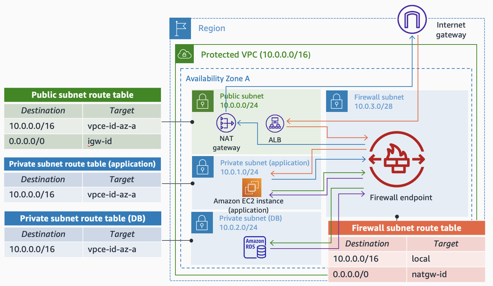

<!-- BEGIN_TF_DOCS -->
# AWS Network Firewall Module - Intra-VPC Inspection

This example builds AWS Network Firewall in a single VPC to perform intra-VPC inspection between its subnets. The image below shows an example of the architecture, routing configuration, and traffic flow.

The AWS Region used in the example is **eu-west-2 (London)**. Five different subnet types are created (inspection, endpoints, private1, private2, and private3). The first two subnet types are used to place the firewall endpoints from AWS Network Firewall (*inspection*) and the SSM VPC endpoints to access the EC2 instances (*endpoints*). The other three subnet types are used to place EC2 instances. To test the firewall policy, the following traffic will be allowed (ICMP):

* EC2 instances between subnets *private1* and *private2*.
* EC2 instances between subnets *private2* and *private3*.
* Traffic between subnets *private1* and *private3* will be blocked.

You can check the firewall policy applied in the *policy.tf* file.

## Prerequisites

* An AWS account with an IAM user with the appropriate permissions
* Terraform installed

## Code Principles

* Writing DRY (Do No Repeat Yourself) code using a modular design pattern

## Usage

* Clone the repository
* Edit the *variables.tf* file in the project root directory

**Note** EC2 instances, VPC endpoints, and Network Firewall endpoints will be deployted in all the Availability Zones used in the example (*var.vpc.number\_azs*). By default, the number of AZs used is 2 to follow best practices. Take that into account when doing tests from a cost perspective.

## Requirements

| Name | Version |
|------|---------|
|  [terraform](#requirement\_terraform) | >= 0.15.0 |
|  [aws](#requirement\_aws) | >= 4.0.0, < 5.0.0 |
|  [awscc](#requirement\_awscc) | >= 0.24.0 |

## Providers

| Name | Version |
|------|---------|
|  [aws](#provider\_aws) | >= 4.0.0, < 5.0.0 |

## Modules

| Name | Source | Version |
|------|--------|---------|
|  [compute](#module\_compute) | ./modules/compute | n/a |
|  [iam](#module\_iam) | ./modules/iam | n/a |
|  [network\_firewall](#module\_network\_firewall) | ../.. | n/a |
|  [vpc](#module\_vpc) | ./modules/vpc | n/a |
|  [vpc\_endpoints](#module\_vpc\_endpoints) | ./modules/vpc_endpoints | n/a |

## Resources

| Name | Type |
|------|------|
| [aws_networkfirewall_firewall_policy.anfw_policy](https://registry.terraform.io/providers/hashicorp/aws/latest/docs/resources/networkfirewall_firewall_policy) | resource |
| [aws_networkfirewall_rule_group.allow_domains](https://registry.terraform.io/providers/hashicorp/aws/latest/docs/resources/networkfirewall_rule_group) | resource |
| [aws_networkfirewall_rule_group.allow_icmp](https://registry.terraform.io/providers/hashicorp/aws/latest/docs/resources/networkfirewall_rule_group) | resource |
| [aws_networkfirewall_rule_group.drop_remote](https://registry.terraform.io/providers/hashicorp/aws/latest/docs/resources/networkfirewall_rule_group) | resource |

## Inputs

| Name | Description | Type | Default | Required |
|------|-------------|------|---------|:--------:|
|  [aws\_region](#input\_aws\_region) | AWS Region. | `string` | `"us-east-2"` | no |
|  [identifier](#input\_identifier) | Project identifier. | `string` | `"single-vpc"` | no |
|  [vpc](#input\_vpc) | Information about the VPC to create. | `any` | <pre>{   "cidr_block": "10.129.0.0/16",   "firewall_subnet_cidrs": [     "10.129.0.0/24",     "10.129.1.0/24",     "10.129.2.0/24"   ],   "instance_type": "t2.micro",   "number_azs": 2,   "private_subnet_cidrs": [     "10.129.6.0/24",     "10.129.7.0/24",     "10.129.8.0/24"   ],   "protected_subnet_cidrs": [     "10.129.3.0/24",     "10.129.4.0/24",     "10.129.5.0/24"   ] }</pre> | no |

## Outputs

| Name | Description |
|------|-------------|
|  [ec2\_instances](#output\_ec2\_instances) | EC2 Instances. |
|  [network\_firewall](#output\_network\_firewall) | AWS Network Firewall ID. |
|  [vpc](#output\_vpc) | VPC ID. |
|  [vpc\_endpoints](#output\_vpc\_endpoints) | SSM VPC endpoints. |
<!-- END_TF_DOCS -->